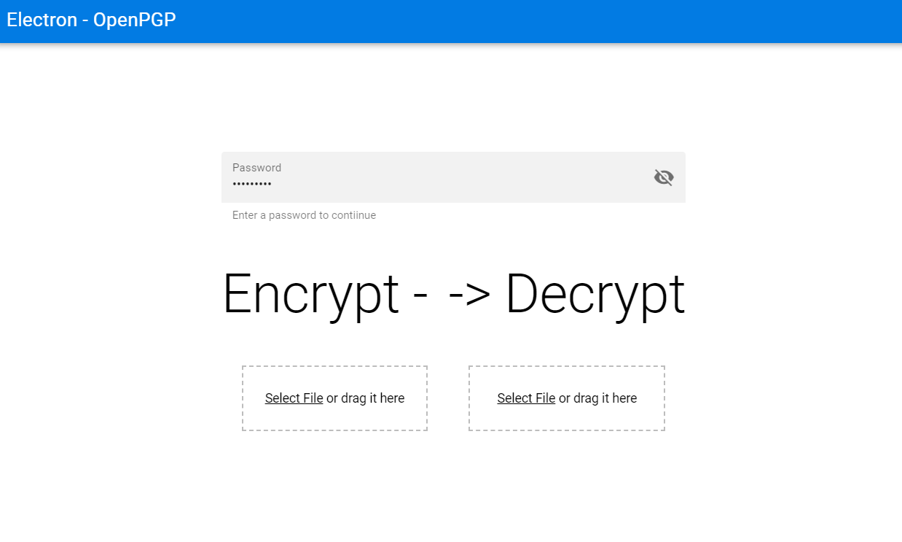

# OpenPGP-Electron

A portable OpenPGP file encrypter/decrypter



## Download
[Download](https://github.com/stefnotch/OpenPGP-Electron/releases)

## Used
- [Quasar](https://quasar-framework.org/)
- [Vue.js](https://vuejs.org/)
- [Electron](https://electronjs.org/)
- [OpenPGP](https://github.com/openpgpjs/openpgpjs)

## Installation Instructions
```

# Alternatively, you can clone this repo using GitKraken
# Clone this repository
git clone https://github.com/stefnotch/youtrack-diagram
# Go into the repository
cd youtrack-diagram

# Install dependencies
npm install
# Run the app (Development Mode)
npm run dev

# To build it
npm run build

# Go to the built application
cd ./dist/electron
```
